# Indice
- [Intro](#intro)
- [I modelli usati](#i-modelli-usati)
  - [ESN1](#esn1)
  - [ESN2](#esn2)
  - [ESN3](#esn3)
  - [ESN4](#esn4)
- [Esperimenti](#esperimenti)
  - [Datasets usati](#datasets-usati)
  - [ArticularyWordRecognition](#articularywordrecognition)
  - [CharacterTrajectories](#charactertrajectories)
  - [Epilepsy](#epilepsy)
  - [JapaneseVowels](#japanesevowels)
  - [Libras](#libras)
  - [SpokenArabicDigits](#spokenarabicdigits)
- [Summary & Considerazioni](#summary--considerazioni)
  - [BestModels](#bestmodels)
  - [Multiple S.R.](#multiple-sr)
  - [Single S.R.](#single-sr)
- [Implementazione](#implementazione)
- [TODO & IDEAS](#todo--ideas)

# Intro

Si vuole verificare se si ottiene un aumento di accuratezza, a parità di dimensione del reservoir, nel suddividere le **N** feature di
un dataset in altrettante reti di tipo ESN con successiva unione dell'output di queste **N** reti.

<!-- 
Le architetture sviluppate e testate utilizzano come base, l'architettura ESN di conseguenza sono formate da un reservoir
e da un readout. Il reservoir come nell'architettura ESN è formato da un kernel e da un kernel ricorrente. 
-->

# I modelli usati

Per semplificare l'implementazione e aumentare le performance delle architetture testate, le **N** reti ESN utilizzate vengono 
riunite come un unico reservoir opportunamente costruito.

Per semplificare le successive spiegazioni assegno dei nomi (nomi definitivi TbA) alle varie modifiche usate.

## ESN1

Si tratta del modello ESN standard come definito nel paper "".
Gli iper-paramentri sono quindi:
 - il numero di unità **U**
 - il fattore di connessione nel kernel ricorrente
 - il raggio spettrale
 - il fattore leaky
 - l'input scaling
 - il bias scaling

Quindi per un dataset di N feature abbiamo sempre sei iper-parametri.

Esempio di modello ESN:

 

## ESN2

Questa è la prima modifica ai modelli ESN presa in considerazione, l'idea alla base è quella di suddividere le **N** feature 
del dataset in **N** sub-reservoirs diversi ma avendo la stessa dimensione e questi sub-reservoirs non sono comunicati tra loro. 

Tutto ciò è viene implementato come un grande reservoir che contiene al suo interno gli **N** sub-reservoirs, dividendo il 
kernel in **N** matrici di dimensione <1; **U**nits / **N**>, e il recurrent kernel anch'esso diviso in **N** matrici di dimensione 
<**U**nits / **N**; **U**nits / **N**>. 
Esempio di distribuzione dei pesi:


Gli iper-parametri presenti in questo modello:

  - Il raggio spettrale è un vettore di dimensione **N**, e indica il raggio spettrale dell' i-esimo sub-reservor.
  - Il raggio spettrale (G.S.R.) di tutto il reservoir una volta costruito, opzionale.
  - Il fattore di connessione è un vettore di dimensione **N** che rappresenta l'interconnessione all'interno dell'i-esimo reservoir.
  - Il bias scaling e l'input scaling sono vettori di dimensione **N**.
  
Quindi se si utilizza dataset di **N** feature si arriva al massimo a: 4 * **N** + 3 iper-parametri
4 si ottiene per via del vettore dei raggi spettri, vettore connessione e i 2 vettori per l'input e l'output scaling
3 si ottine per: il numero di unità che il reservoir contiene, i raggio spettrale del reservoir e il fattore leaky.

Il numero di sub-reservoir non è un iper-parametro perchè dipende strettamente dal dataset utilizzato. 

## ESN3

In questo modello vengono aggiunte le interconnessioni tra gli **N** sub-reservoir presenti nel modello ESN2,


Ulteriori iper-parametri:
  - Il fattore di connessione diventa una matrice di dimensione <**N**; **N**> dove la diagonale indica il fattore di
connessione del sub-reservor mentre i valori off-diagonali sono il valore di connessione tra due sub-reservoir. Questo
permette che la connessione tra il reservoir i-esimo e j-esimo sia diversa dalla connessione tra j-esimo e i-esimo.
  - Si aggiunge una matrice di dimensione <**N**; **N**> per indicare i valori massimi che le matrici di inter-connessione possono avere.
La diagonale di questa matrice non viene utilizzata.

Quindi se si utilizza dataset di **N** feature si arriva a: 2 * **N** ^ 2 + 2 * **N** + 3 iper-parametri:

 - il primo 2 si ottiene per via delle due matrici **N** e un vettore, le matrici sono di connessione e i limiti tolta la diagonale (lunga **N**) 
ma si aggiunge il vettore dei raggi spettrali lungo **N**.
 - il secondo 2 sono il bias scaling e l'output scaling.
 - 3 si ottiene per il numero di unità che il reservoir contiene i raggio spettrale del reservoir e il fattore leaky.

## ESN4

In questo "modello" c'è la possibilità di variare le dimensioni dei sub-reservoirs.

Esempio di reservoirs con due sub-reservoir di dimensione differente.


Si aggiunge agli iper-parametri del modello ESN3 un vettore che indica il partizionamento delle unità nei vari sub-reservoirs; 
quindi nel conteggio degli iper-parametri bisogna aggiungere **N** valori ottenendo 2 * **N** ^ 2 + 3 * **N** + 3 iper-parametri.

Come si nota il numero di iper-parametri cresce esponenzialmente al crescere delle feature di un dataset.

Negli esperimenti successivi si utilizzeranno anche dataset con 13 feature, ciò porterebbe il numero di iper-parametri a 380 rendendo completamente 
inutile o estremamente lunga la fase di model selection.

# Esperimenti

<!-- Formule Da controllare da qui in poi -->

In tutti gli esperimenti la matrice di inter-connessione e i valori massimi delle inter-connessioni vengono rappresentate ciascuna come unico valore,
riducendo esponenzialmente il numero di iper-parametri da ricercare.

Al momento sono stati effettuati queste classi di esperimenti per ogni dataset:

 - "Best model": un singolo esperimento dove tutti gli iper-parametri dei modelli sono cercati tramite model selection. Iper-parametri: 4 * **N** + 5 (ESN3).
 - "Multiple S.R.": una serie di esperimenti dove il numero di unità viene fissato a 50 75 100 150 250 per esperimento; 
il fattore di connessione dei sub-reservoirs viene fissato a 1, tramite model selection si cercano **N** raggi spettrali per
i sub reservoirs e l'input scaling e il bias scaling non sono vettori ma 2 valori distinti. Iper-parametri: **N** + 7
 - "Single S.R.": uguale a "Multiple S.R." solo che si utilizza un raggio spettrale per gli N sub-reservoirs. Iper-parametri: 8

Ogni modello di ogni esperimento è stato ottenuto tramite models selection, è stato utilizzato come tuner il BayesianOptimization 
con un numero massimo di tentativi pari a 100 e come ottimizzatore Adam.

I valori di accuratezza seguenti sono stati ottenuti eseguendo il training su dieci diversi modelli rigenerati utilizzando i miglio iper-parametri ottenuti.
Questo perchè essendo il reservoir statico una sua differente inizializzazione fornisce risultati diversi.

Ai dataset non è stato effettuato alcun post-processing, se non l'unico accorgimento di utilizzare splitting stratificato.

Datasets usati
-------------

|        | ArticularyWordRecognition | CharacterTrajectories | Epilepsy | JapaneseVowels  | Libras | SpokenArabicDigits |
|--------|:-------------------------:|:---------------------:|:--------:|:---------------:|:------:|:------------------:|
| Input  |             9             |           3           |    3     |       12        |   2    |         13         |
| Output |            25             |          20           |    4     |        9        |   15   |         10         |

## ArticularyWordRecognition

Questi dati sono stati prelevati tramite 12 sensori posizionati sulla lingua e sulla faccia di nativi Inglesi i quali pronunceranno 25 parole (le classi di output), 
ognuno di questi sensori riporta la propria posizione X Y Z per un totale di 36 features, ma in questo dataset soltanto 9 vengono usate,

### BestModels


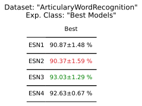

### Multiple S.R.


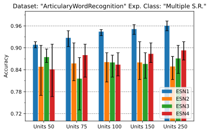

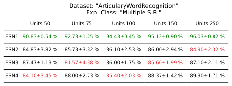

### Single S.R.


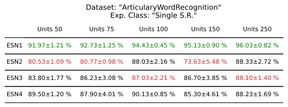

## CharacterTrajectories

In questo dataset vengono rappresentati dei caratteri scritti su una tavoletta grafica, infatti il dataset è composto da tre componenti la posizione <X,Y> della penna e la pressione che esercita sulla tavoletta.
I caratteri registrati sono 'a' 'b' 'c' 'd' 'e' 'g' 'h' 'l' 'm' 'n' 'o' 'p' 'q' 'r' 's' 'u' 'v' 'w' 'y' 'z', quindi 20 classi diverse.

### BestModels


### Multiple S.R.

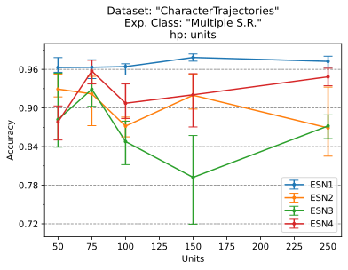


### Single S.R.

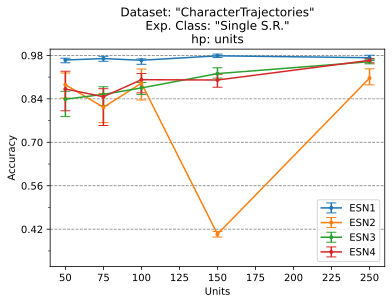


## Epilepsy

### BestModels


### Multiple S.R.


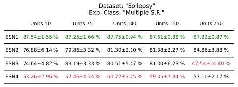

### Single S.R.


## JapaneseVowels

### BestModels


### Multiple S.R.


### Single S.R.

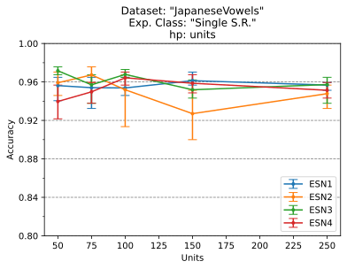


## Libras

LIBRAS, è l'acronimo in Portoghese di "Lingua BRAsileira de Sinais", che è la lingua dei segni ufficiale brasiliana. 
La componenti del dataset sono le direzioni delle mani.

### BestModels


### Multiple S.R.


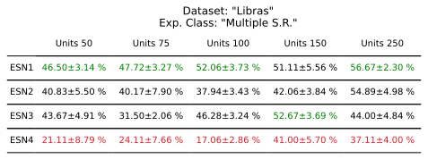

### Single S.R.


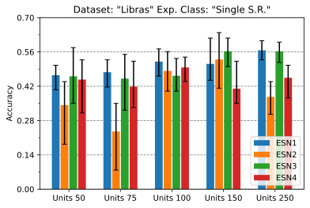


## SpokenArabicDigits

Questo data set è derivato da file audio, composto da 8800 (10 cifre x 10 ripetizioni x 88 partecipanti) serie temporali di 13 
Frequency Cepstral Coefficients (MFCCs) ottenuti da 44 maschi e 44 femmine che parlano Arabo come lingua madre tra i 18 e i 40 anni di età che rappresentano le prime 10 cifre arabe. 

### BestModels


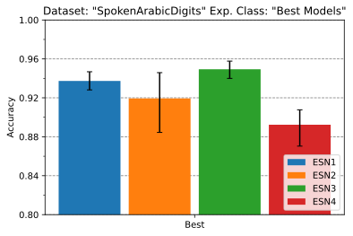


### Multiple S.R.


### Single S.R.


# Summary & Considerazioni

## BestModels


L'unico modello tra i quelli testati che spicca è il modello ESN che nel primo terzo e ultimo dataset ottengono risultati migliori. 

## Multiple S.R.


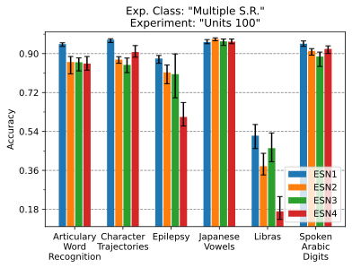
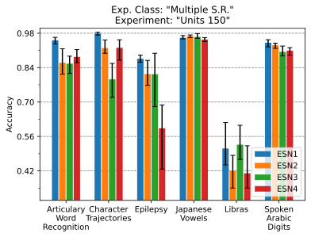
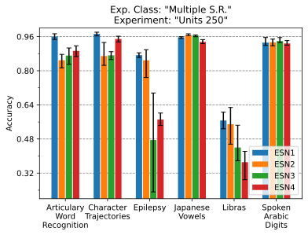

## Single S.R.


Tranne che per il dataset japaneseVowels, i modelli testati non ottengono miglioramenti rispetto al modello ESN standard.
Questi risultati "negativi" credo siano dovuti all'alto numero di iper-parametri. Anche se nel'esperimento "Single S.R." il numero di iper-parametri è costante.

Un fatto da notare è l'alta variabilità dei nuovi modelli rispetto a ESN1

Ulteriori grafici e tabelle (anche degli iper-parametri) si trovano all'interno della cartella ```plots/benchmars```, dove sono suddivisi per dataset.

# Implementazione

Out dated!!

I modelli vengono definiti all'interno del file ```lib/models.py```, ed ereditano dalla classe "ESNInteface" i metodi di call, fit e evaluate,
le differenze tra i modelli sono le funzioni d'inizializzazione del reservoir nella funzione di init.

Tutti modelli da me implementati sono formati da due modelli di tipo keras.Sequential, il primo composto da:
- un livello di masking
- un livello ESN definito in ```lib/esn.py```.

Il secondo è il readout ed è costituito da un solo livello Denso.
Il livello ESN eredita da tf.keras.layers.RNN dove al suo interno troviamo la cell definita dalla classe Reservoir sempre nel solito file.
La classe Reservoir vengono passate le funzioni di inizializzazione del kernel e del recurrent kernel, tali funzioni vengono definite nel file ```lib/initializers.py```. 

Per i kernel esistono 2 inizializzatori:
- ```Kernel``` per generare kernel "standard"
- ```SplitKernel``` genera kernel tali da fornire la feature di input soltanto a un sottoinsieme di unita nel recurrent kernel. 
Per ottenere ciò si creano N matrici della giusta dimensione e si uniscono tramite la funzione tf.linalg.LinearOperatorBlockDiag
che andrà a generare una nuova matrice avendo sulla diagonale le matrice precendentemente generate e zero da le altre parti.

Per i recurrent kernel :
- ```RecurrentFullConnected``` usato per ESN1
- ```RecurrentKernel``` usato per generare i kernel ricorrenti con i N sub-reservoir, andando a generare NxN matrici ognuna con le proprietà necessarie,
per poi andarle a riunificare in una sola matrice.
- ```Type2, Type3, Type4``` Ereditano da ```RecurrentKernel``` e servono per poter fornire i giusti parametri alla classe ereditata.

# TODO & IDEAS

### TODO
I modelli ESN1 per i test single s.r. e multiple s.r sono uguali quindi è inutile effettuare il doppio training. Da implementare...
 <!-- Altra architettura dove il kernel usa l'inizializzatore SplitKernel mentre il kernel ricorrente uguale a ESN1. -->

### IDEAS

Rinominare le reti
 - ESN1 -> ESN
 - ESN2 -> SESN (Split ESN) / MESN (Multiple ESN)
 - ESN3 -> SESNI (Split ESN Interconnected) / MESNI (Multiple ESN Interconnected)
 - ESN4 -> SESNIS (Split ESN Interconnected Sized) / MESNIS (Multiple ESN Interconnected Sized)


