# Indice

- [I modelli usati](#i-modelli-usati)
  - [ESN1:](#esn1)
  - [ESN2:](#esn2)
  - [ESN3:](#esn3)
  - [ESN4:](#esn4)
- [Esperimenti](#esperimenti)
- [Risultati ottenuti](#risultati-ottenuti)
  - [Datasets usati](#datasets-usati)
    - [ArticularyWordRecognition](#articularywordrecognition)
    - [CharacterTrajectories](#charactertrajectories)
    - [Libras](#libras)
    - [SpokenArabicDigits](#spokenarabicdigits)
  - [Considerazioni](#considerazioni)
      - [Altro](#altro)
- [Implementazione](#implementazione)
- [TODO & IDEAS](#todo--ideas)
  - [TODO](#todo)
  - [IDEAS](#ideas)

# I modelli usati

Tutti i modelli sono formati da un reservoir e da un readout, il reservoir è formato da un kernel e da un kernel ricorrente.
Quello che è stato modificato in questi esperimenti è come le feature di un dataset vengono fornite al reservoir, 
di conseguenza la disposizione dei pesi nelle matrici del reservoir.

Per semplificare le successive spiegazioni assegno dei nomi alle varie modifiche usate.

## ESN1:

Si tratta del modello ESN standard come definito nel paper "".
I parametri sono il numero di unità, il fattore di connessione nel kernel ricorrente, il raggio spettrale, il fattore leaky, l'input scaling e il bias scaling. 


 

## ESN2:

Questa è la prima modifica ai modelli ESN presa in considerazione, 
l'idea alla base è quella di suddividere le N feature del dataset in N sub-reservoirs diversi ma con stessa dimensione non comunicati tra loro. 

Tutto ciò è stato implementato come un grande reservoir che contiene al suo interno gli N sub-reservoirs, dividendo il kernel in N matrici di dimensione 1 X Units / N, e il recurrent kernel
anch'esso diviso in N matrici di dimensione Units / N X Units / N. 
Esempio di distribuzione dei pesi:


Richiede come principale parametro aggiuntivo il numero di sub-reservoir da generare al proprio interno. 
Alcuni parametri si estendono per funzionalità aggiuntive per effettuare un tuning più fine sono:
    - Il raggio spettrale può essere un vettore di dimensione N, e indica il raggio spettrale dell' i-esimo sub-reservor.
    - Il fattore d' interconnessione può essere un vettore di dimensione N che rappresenta l'interconnessione all'interno dell'i-esimo reservoir.
Ma possono essere usati come valore per avere i sub-reservoir con gli stessi parametri


## ESN3:

In questo modello vengono aggiunte le interconnessioni tra i sub-reservoir presenti nel modello ESN2, il valore di queste interconnessioni può essere trovato tramite models selection. 


Non si aggiungono parametri si estende il vettore d'interconnessione a una matrice d'interconnessione tra gli N sub-reservoirs.


## ESN4:

Non ci sono modifiche logiche rispetto al modello ESN3, in questo "modello" c'è la possibilità di variare le dimensioni dei sub-reservoirs.

Esempio di reservoirs con due sub-reservoir di dimensione differente


# Esperimenti

Al momento sono stati effettuati tipi/classi di esperimenti:

 - "Best model": un singolo esperimento dove tutti gli iper-parametri dei modelli sono cercati tramite model selection, cosi facendo si ottiene per ogni tipo di modello il modello con migliore accuracy (ma non succede sempre [BUG?])
 - "Multiple S.R.": una serie di esperimenti dove il numero di unità viene fissato a 50 75 100 150 250 per esperimento; il fattore di connessione dei sub-reservoirs viene fissato a 1, e si utilizza un solo valore di inter-connessione tra i sub-reservoir per vedere come l'accuratezza aumenti all'aumentare del numero di unità, tramite model selection si cercano N raggi spettrali per i sub reservoirs.
 - "Single S.R.": uguale a "Multiple S.R." solo che si utilizza un raggio spettrale per gli N sub reservoirs.

Ogni modello è stato ottimizzato tramite models selection per ogni singolo esperimento, così da ottenere la massima accuratezza ogni volta.
Ai dataset non è stato effettuato alcun post-processing, se non l'unico accorgimento di utilizzare splitting stratificato.

Datasets usati
-------------

|        | ArticularyWordRecognition | CharacterTrajectories | Epilepsy | JapaneseVowels  | Libras | SpokenArabicDigits |
|--------|:-------------------------:|:---------------------:|:--------:|:---------------:|:------:|:------------------:|
| Input  |             9             |           3           |    3     |       12        |   2    |         13         |
| Output |            25             |          20           |    4     |        9        |   15   |         10         |

## ArticularyWordRecognition

Questi dati sono stati prelevati tramite 12 sensori posizionati sulla lingua e sulla faccia di nativi Inglesi i quali pronunceranno 25 parole (le classi di output), 
ognuno di questi sensori riporta la propria posizione X Y Z per un totale di 36 features, ma in questo dataset soltanto 9 vengono usate,

### BestModels

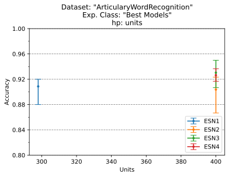
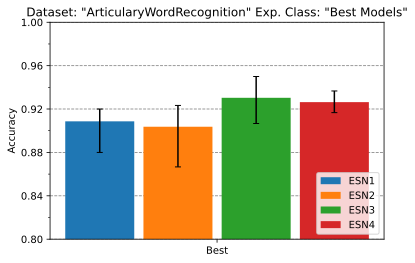


### Multiple S.R.


### Single S.R.


## CharacterTrajectories

In questo dataset vengono rappresentati dei caratteri scritti su una tavoletta grafica, infatti il dataset è composto da tre componenti la posizione <X,Y> della penna e la pressione che esercita sulla tavoletta.
I caratteri registrati sono 'a' 'b' 'c' 'd' 'e' 'g' 'h' 'l' 'm' 'n' 'o' 'p' 'q' 'r' 's' 'u' 'v' 'w' 'y' 'z', quindi 20 classi diverse.

### BestModels


### Multiple S.R.


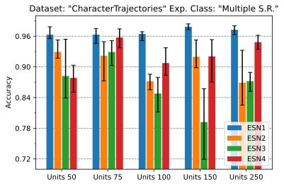
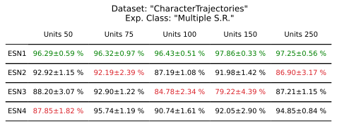

### Single S.R.


Vecchi risultati:

| UNITS | ESN 1       | ESN 2       | ESN 3       | ESN 4       |
|-------|-------------|-------------|-------------|-------------|
| 25    | 71.28±3.35% | 76.38±1.59% | 74.40±4.28% | 83.11±4.60% |
| 50    | 77.66±2.66% | 82.98±2.94% | 84.83±1.85% | 87.80±4.68% |
| 75    | 82.74±3.63% | 85.58±2.60% | 80.75±2.79% | 90.65±3.31% |
| 100   | 84.46±2.36% | 89.47±0.83% | 92.06±1.13% | 90.95±2.03% |
| 125   | 85.40±2.47% | 87.66±3.43% | 93.91±1.95% | 93.52±0.71% |
| 150   | 85.81±1.56% | 90.03±2.43% | 93.75±1.70% | 94.67±0.69% |
| 175   | 86.85±2.49% | 83.31±4.26% | 93.43±2.91% | 93.38±2.47% |
| 200   | 87.49±2.33% | 90.74±2.49% | 94.28±0.74% | 95.18±1.33% |


## Epilepsy

### BestModels


### Multiple S.R.


### Single S.R.


## JapaneseVowels

### BestModels


### Multiple S.R.


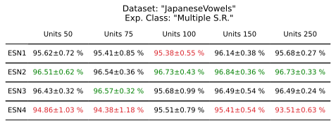

### Single S.R.


## Libras

LIBRAS, è l'acronimo in Portoghese di "Lingua BRAsileira de Sinais", che è la lingua dei segni ufficiale brasiliana. 
La componenti del dataset sono le direzioni delle mani.

### BestModels


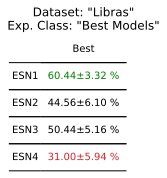

### Multiple S.R.

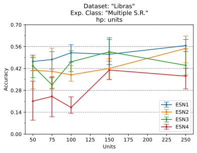


### Single S.R.


## SpokenArabicDigits

Questo data set è derivato da file audio, composto da 8800 (10 cifre x 10 ripetizioni x 88 partecipanti) serie temporali di 13 
Frequency Cepstral Coefficients (MFCCs) ottenuti da 44 maschi e 44 femmine che parlano Arabo come lingua madre tra i 18 e i 40 anni di età che rappresentano le prime 10 cifre arabe. 

### BestModels


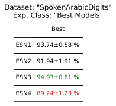

### Multiple S.R.

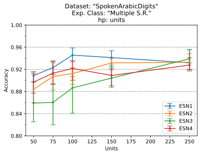
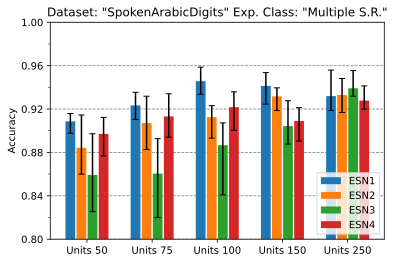
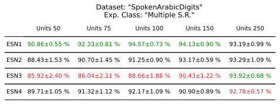

### Single S.R.


## Summary

### BestModels

### Multiple S.R.


### Single S.R.


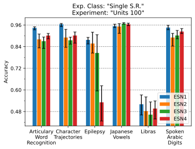
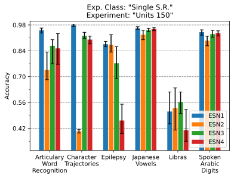


## Considerazioni


#### Altro

Ulteriori grafici si trovano all'interno della cartella ```images``` dove sono suddivisi per dataset.

# Implementazione

I modelli vengono definiti all'interno del file ```lib/models.py```, ed ereditano dalla classe "ESNInteface" i metodi di call, fit e evaluate,
le differenze tra i modelli sono le funzioni d'inizializzazione del reservoir nella funzione di init.

Tutti modelli da me implementati sono formati da due modelli di tipo keras.Sequential, il primo composto da:
- un livello di masking
- un livello ESN definito in ```lib/esn.py```.

Il secondo è il readout ed è costituito da un solo livello Denso.
Il livello ESN eredita da tf.keras.layers.RNN dove al suo interno troviamo la cell definita dalla classe Reservoir sempre nel solito file.
La classe Reservoir vengono passate le funzioni di inizializzazione del kernel e del recurrent kernel, tali funzioni vengono definite nel file ```lib/initializers.py```. 

Per i kernel esistono 2 inizializzatori:
- ```Kernel``` per generare kernel "standard"
- ```SplitKernel``` genera kernel tali da fornire la feature di input soltanto a un sottoinsieme di unita nel recurrent kernel. 
Per ottenere ciò si creano N matrici della giusta dimensione e si uniscono tramite la funzione tf.linalg.LinearOperatorBlockDiag
che andrà a generare una nuova matrice avendo sulla diagonale le matrice precendentemente generate e zero da le altre parti.

Per i recurrent kernel :
- ```RecurrentFullConnected``` usato per ESN1
- ```RecurrentKernel``` usato per generare i kernel ricorrenti con i N sub-reservoir, andando a generare NxN matrici ognuna con le proprietà necessarie,
per poi andarle a riunificare in una sola matrice.
- ```Type2, Type3, Type4``` Ereditano da ```RecurrentKernel``` e servono per poter fornire i giusti parametri alla classe ereditata.

# TODO & IDEAS

### IDEAS

- ESN1.2 = kernel uguale a ESN2 (splitted) mentre il kernel ricorrente uguale a ESN1